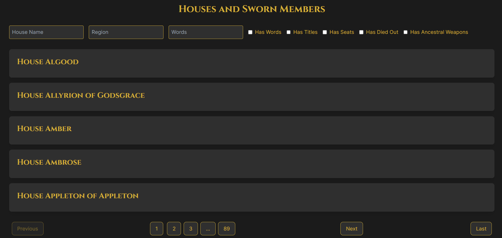

# Game of Thrones Houses and Characters Tracker



## Overview

This application helps fans of the epic series "A Song of Ice and Fire" by George R. R. Martin (popularly known through its TV adaptation "Game of Thrones") keep track of the numerous houses and their sworn members. It utilizes the data from [An API of Ice and Fire](https://anapioficeandfire.com/) to provide detailed information about each house and its members.

## Features

- **House Information:** View a list of houses from the "Game of Thrones" universe, including their region, coat of arms, words, and titles.
- **Sworn Members:** For each house, see a detailed list of its sworn members, including their full name, gender, culture, titles, and whether they are alive or dead.
- **Filtering:** Filter houses based on various criteria such as house name, region, and specific attributes (e.g., has words, has titles, etc.).
- **Pagination:** Efficiently navigate through the list of houses with a pagination system that handles large datasets gracefully.
- **Caching:** Implements server-side caching to reduce redundant API calls and improve performance.
- **Responsive Design:** Optimized for both desktop and mobile devices.

## Technologies Used

- **Next.js:** A React framework for building server-side rendered (SSR) applications.
- **TypeScript:** Ensures type safety and reduces runtime errors.
- **Tailwind CSS:** A utility-first CSS framework for styling the application.
- **Axios:** For making HTTP requests to the Ice and Fire API.
- **Context API:** Manages state and data across the application components.
- **Debouncing:** Improves performance by reducing the number of API calls during user interactions.

## Installation and Setup

1. Clone the repository:

    ```bash
    git clone https://github.com/matiasfnunezdev/an-app-of-ice-and-fire.git
    cd an-app-of-ice-and-fire
    ```

2. Install dependencies:

    ```bash
    npm install
    ```

3. Run the development server:

    ```bash
    npm run dev
    ```

4. Open [http://localhost:3000](http://localhost:3000) in your browser to see the application.

## Usage

### Filter Houses

- Use the filter input fields to narrow down the list of houses based on specific criteria.
- Check or uncheck the filter checkboxes to include or exclude houses with specific attributes.

### View House Details

- Click on a house name to expand and view the details of its sworn members.

### Pagination

- Use the pagination buttons to navigate through the pages of houses.

## Folder Structure

- `/src`
  - `/app`
  - `/_core`: Core functionalities such as caching and configuration.
  - `/_data`: Data layer containing API implementations.
  - `/_domain`: Domain-specific interfaces and types.
  - `/_presentation`: UI components and view models.
  - `/pages`: Next.js pages.
  - `/styles`: Global styles.

## Contributions

Contributions are welcome! Please open an issue or submit a pull request with your improvements.

## License

This project is licensed under the MIT License.

## Acknowledgements

- [An API of Ice and Fire](https://anapioficeandfire.com/) for providing the data.
- Next.js, Tailwind CSS, and Axios for the technology stack.

Feel free to adjust any sections to better fit your specific implementation or preferences.
